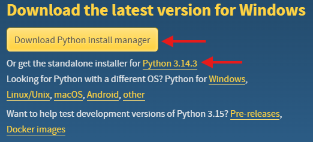

# 🧪 01-02: Environment Setup

---

## 🐍 Install Python 3

### Option 1: Manual

Step 1: Go to official Python website: https://www.python.org/downloads/

Step 2: Download the latest version of Python 



👉 Download:
- Python 3.x.x (recommended)
Or,
- Python Install Manager (optional)

Step 3: Install Python

IMPORTANT:
✔ Check "Add Python to PATH" before clicking Install

---

### Option 2: In PowerShell (Windows) / Terminal

Step 1: Search available Python versions

```winget search Python```

Step 2: Install using exact version from search result

```winget install Python.Python.<version found in Step 1>```

---

### ✅ Verify Installation (in PowerShell/Terminal)

```python --version```

If not working:

```py --version```

---

### 📚 Install Libraries (in PowerShell/Terminal)

General command: 
```pip install <library_name>```

Examples:

```pip install numpy        # numerical computing```
```pip install pandas       # data analysis and handling```
```pip install matplotlib   # data visualization```

Optional (for Reinforcement Learning):
```pip install gymnasium    # RL environments (e.g., CartPole)```

---

### 💻 Install VS Code

Step 1: Download: https://code.visualstudio.com/

Step 2: Install

During installation:
✔ Add to PATH
✔ Add "Open with Code"

---

### 🔌 Install Python Extension in VS Code

Open VS Code → Extensions → Search: Python

Install: Python (by Microsoft)

NOTE: Python extension does NOT install Python

---